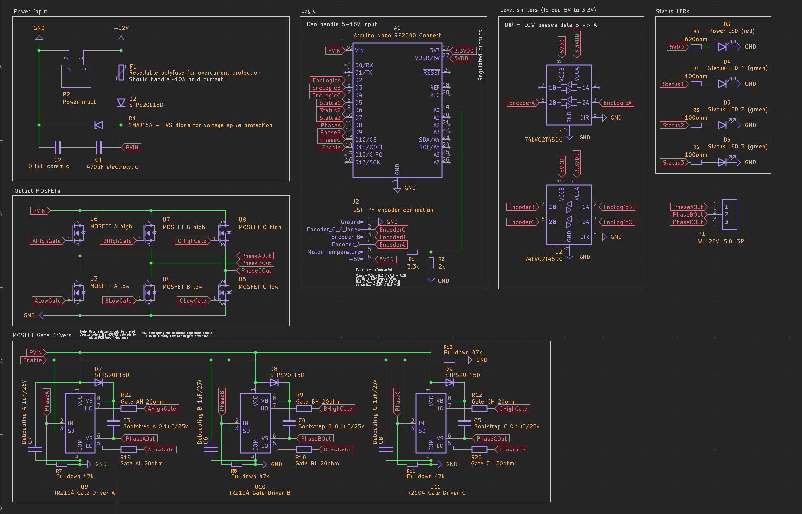
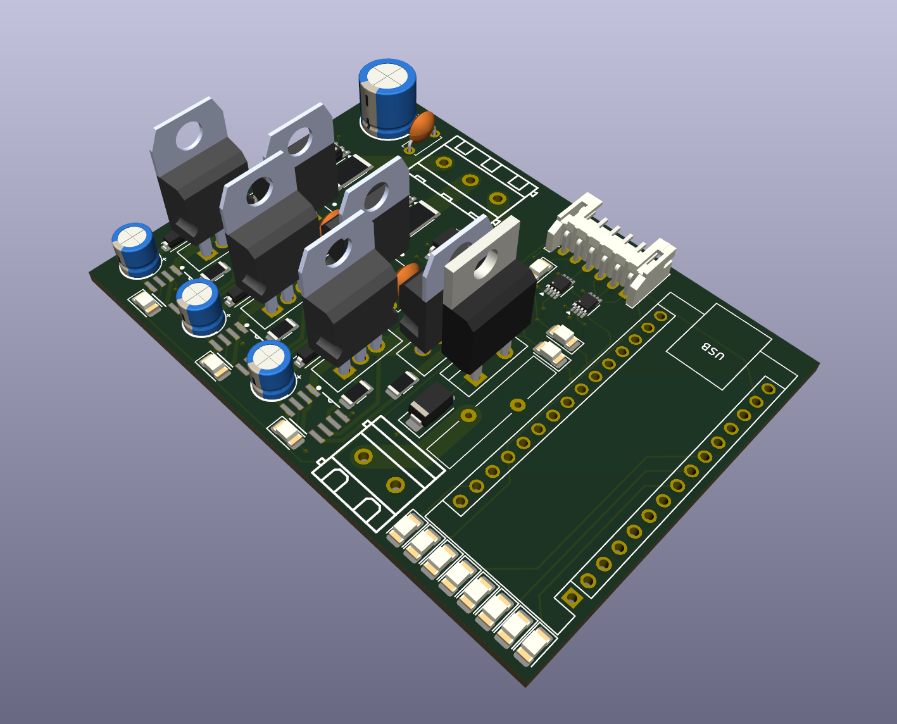
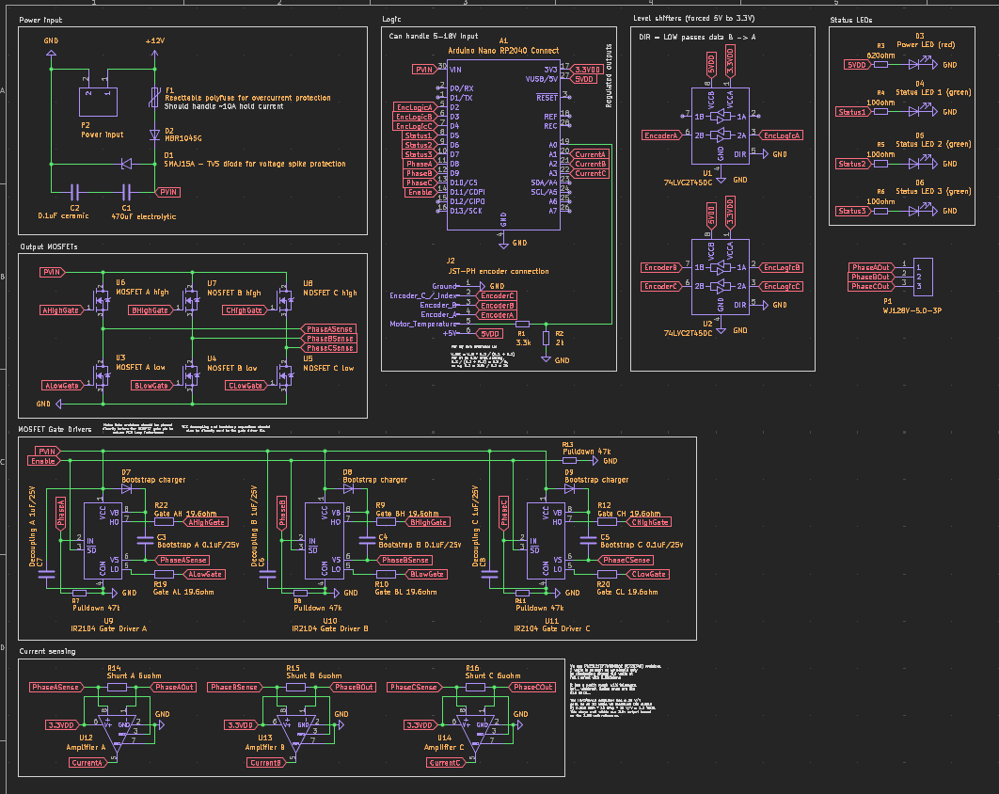
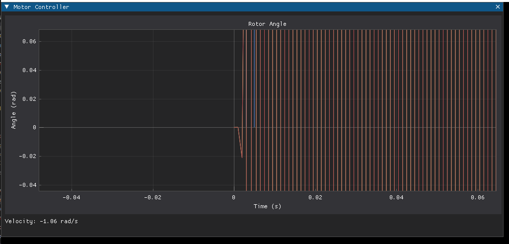
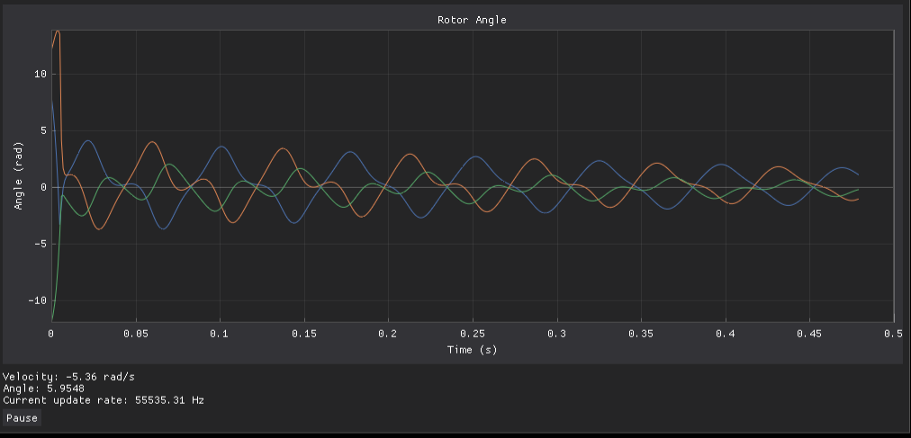
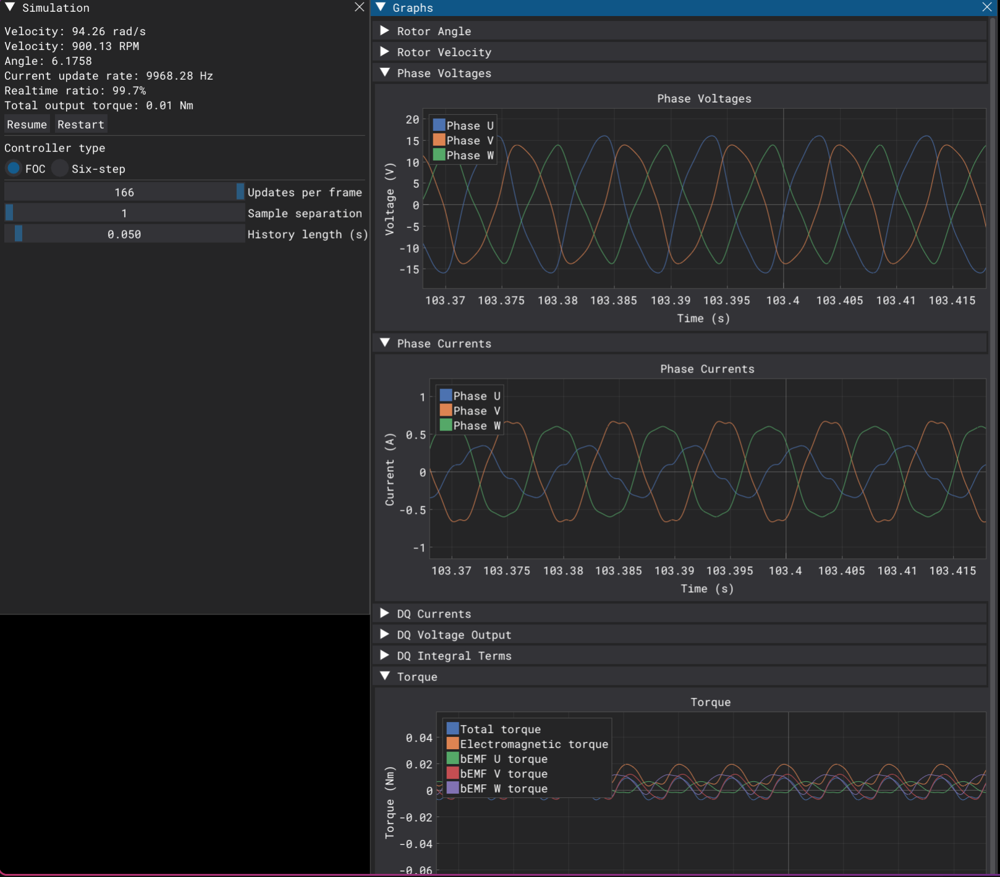

# Small devlog

Total time spent so far: ~19 hours (~11 tracked by hackatime)

## Initial research
Time taken: ~2 hours

I determined the appropriate MOSFETs and circuitry required for field-oriented control.

## Initial PCB
Time taken: ~8 hours

I made the schematic and PCB layout in KiCad for the bare-minimum driver circuitry required for FOC. There were a few flaws with my initial design, like measuring current on the low MOSFET source, which I learned isn't sufficient for field-oriented control.

## Iterating on the PCB
Time taken: ~3 hours

I iterated on the design to make the PCB much more compact and clean. I'm not yet aware of any issues with the new version of the PCB, so next up is software.

## Improve documentation
Time taken: ~30 minutes

I improved the [documentation of the project](https://github.com/Glitch752/focMotorController/blob/472c54bfc41076d94987bcc05ba8eb1525c3219e/README.md).

## Start implementing basic controller simulator in Python
Time taken: ~3 hours

I learned about some of the operating principles of FOC and started implementing a simulator. It's currently _very_ broken and incomplete (and doesn't even simulate phases separately), but I'm slowly improving it.

## Start preparing PCB for JLCPCB
Time taken: ~1 hour

I started preparing the PCB to be manufactured with the excellent [kicad-jlcpcb-tools](https://github.com/Bouni/kicad-jlcpcb-tools) plugin.

## Finish JLCPCB part assignments and create/check exhaustive BOM
Time taken: ~1 hour

## Start FOC writeup
Time taken: ~2 hours

I created an initial writeup of my understanding of field oriented control in the readme.

## Vastly improve motor simulation
Time taken: ~7 hours

The FOC simulaton now sort of, kind of, maybe works!  
At least, we're able to command the motor to slowly spin and move it a bit. The phase outputs look somewhat sinusoidal as well.  
The FOC part itself needs more work, but the motor simulation is certainly better now.

## Improve FOC control and simulator GUI
Time taken: ~5 hours

The simulator is a lot more usable now, and I also implemented a six-step controller as point of comparison for FOC.  
I think the FOC control could still use some work, but it is now stable and works relatively well.  

