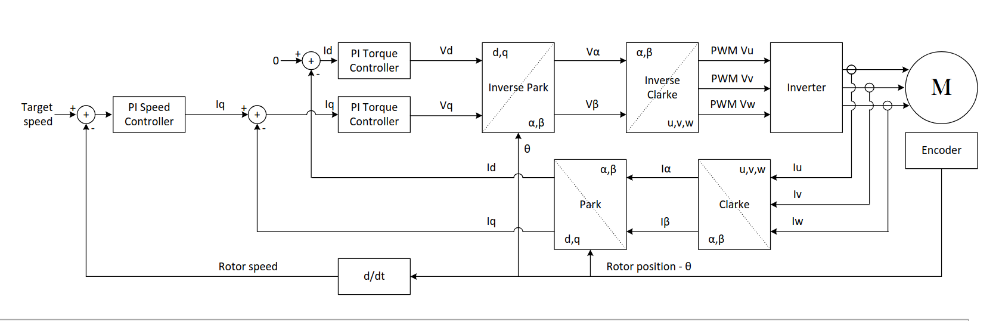
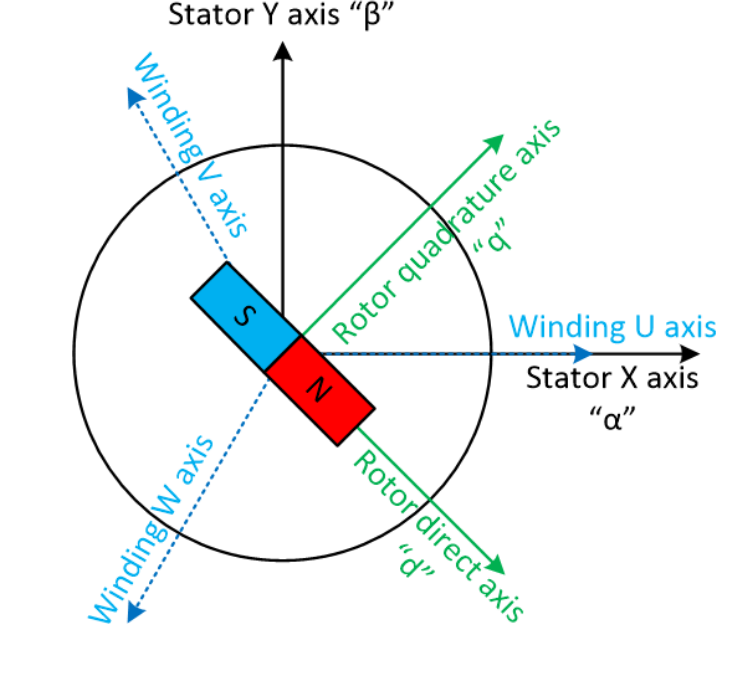

# FOCMotorController

A 12v brushless DC motor controller capable of [field-oriented control](https://en.wikipedia.org/wiki/Vector_control_(motor)) (also known as vector control), which is a control system concept that can improve the efficiency and power output of motors using current-based feedback.

I wanted to learn how field-oriented control systems (and brushless motor controllers in general) work, so I made a PCB from scratch!

</img>

## Design goals
- Allow 10-amp continuous operation
- Run field-oriented control
- Runs off an RP2040 Arduino devboard
- Operate at relatively high efficiency: I don't have a specific goal in mind, but ideally it would experience less than a few watts loss at peak load
- Allow controlling the [REV NEO](https://www.revrobotics.com/rev-21-1650/) series motors from the FRC ecosystem because I have access to many old ones.
- Record accurate quadrature encoder readings for tight closed-loop control
- Build for under $200

## Bill of materials

There are a few main components I needed to choose for this project:
- **MOSFETs:** This is pretty much just a tradeoff between efficiency, size, and price. I landed on the STM [STP55NF06L](https://www.st.com/content/ccc/resource/technical/document/datasheet/49/c5/a8/71/93/60/4f/86/CD00002690.pdf/files/CD00002690.pdf/jcr:content/translations/en.CD00002690.pdf) power MOSFET,
which has a very low static resistance when on with a gate voltage of >10V. At only 3.3V, the resistance is quite high, meaning we need a gate driver circuit to improve the driver's efficiency.
- **Gate drivers**: I chose the [IR2104](https://www.infineon.com/dgdl/Infineon-IR2104-DS-v01_00-EN.pdf?fileId=5546d462533600a4015355c7c1c31671) half-bridge gate drivers primarily because they're cheap and widely available.
Also, since they're half-bridge, they manage both the voltage and ground MOSFETs for their phase, which simplifies the control logic.
- **Current measurement circuitry**: There are [quite a few methods available for sensing current](https://www.nxp.com/docs/en/application-note/AN14164.pdf) in motor controllers, but the simplest is using a shunt resistor and relying on Ohm's law.
This is what I ended up doing. I use a [INA240 amplifier](https://www.ti.com/lit/ds/symlink/ina240.pdf) reading across a 6mΩ resistor to convert the tiny voltage potential difference to something readable by the microcontroller.
I'm interested to see what the signal-to-noise ratio will look like.
- Other miscellaneous things like logic level shifters because we're using a 3.3v microcontroller and 5v encoders. All components use a relatively large form-factor where possible to make hand-soldering simpler (altough there are a few tiny SMT components).

Here are all the components required and their price as of July 2025 from JLCPCB.
Of course, many of these can be sourced cheaper elsewhere and soldered manually.

|Name     |Purpose|Quantity|JLC part number|Total Price|
|---------|-------|--------|---------------|-----------|
|STP55NF06L|The main MOSFET we use|6|[C77582](https://jlcpcb.com/partdetail/STMicroelectronics-STP55NF06L/C77582)|$5.91|
|IR2104STRPBF|The main gate drivers|3|[C2960](https://jlcpcb.com/partdetail/InfineonTechnologies-IR2104STRPBF/C2960)|$1.15|
|Arduino Nano RP2040 Connect|The microcontroller used|1|n/a|$19.10 (on Amazon)|
|SN74LVC2T45DCTR|Level shifters for quadrature encoder input|2|[C22672](https://jlcpcb.com/partdetail/TexasInstruments-SN74LVC2T45DCTR/C22672)|$0.44|
|INA240A1D|The amplifier used for current sensing|3|[C2060769](https://jlcpcb.com/partdetail/TexasInstruments-INA240A1D/C2060769)|$4.32|
|PA2512FKF7W0R006E|The low-resistance 6mΩ shunt resistor|3|[C728340](https://jlcpcb.com/partdetail/YAGEO-PA2512FKF7W0R006E/C728340)|$0.30|
|A16-1000|A resettable fuse for the power input|1|[C135398](https://jlcpcb.com/partdetail/Shenzhen_JDTFuse-A161000/C135398)|$0.09|
|KM477M035F16RR0VH2FP0|470uF capacitor for input smoothing|1|[C47888](https://jlcpcb.com/partdetail/48894-KM477M035F16RR0VH2FP0/C47888)|$0.05|
|KM477M035F16RR0VH2FP0|0.1uF capacitor for input smoothing|1|[C47888](https://jlcpcb.com/partdetail/48894-KM477M035F16RR0VH2FP0/C47888)|$0.05|
|50YXF1MEFC5X11|1uF capacitor for decoupling gate drivers|3|[C2927584](https://jlcpcb.com/partdetail/Rubycon-50YXF1MEFC5X11/C2927584)|$0.13|
|CC1H104MC1FD3F6C10SA|100nF capacitor for bootstrapping|3|[C5375966](https://jlcpcb.com/partdetail/Dersonic-CC1H104MC1FD3F6C10SA/C5375966)|$0.07|
|S6B-PH-K-S(LF)(SN)|6-pin JST connector for encoder|1|[C157920](https://jlcpcb.com/partdetail/JST-S6B_PH_K_S_LF_SN/C157920)|$0.07|
|XL-3216UGC-FB|Green status LEDs|3|[C3646937](https://jlcpcb.com/partdetail/XINGLIGHT-XL_3216UGCFB/C3646937)|$0.04|
|XL-3216SURC-FB|Red power LED|1|[C3646938](https://jlcpcb.com/partdetail/XINGLIGHT-XL_3216SURCFB/C3646938)|$0.01|
|B0530W|500mA diode for bootstrap power|3|[B0530W](https://jlcpcb.com/partdetail/2459-B0530W/C2102)|$0.10|
|MBR1045G|10A Schottky Diode for power source|1|[C79734](https://jlcpcb.com/partdetail/onsemi-MBR1045G/C79734)|$0.86|
|SMAJ15A|TVS diode for voltage spike protection|1|[C113958](https://jlcpcb.com/partdetail/115197-SMAJ15A/C113958)|$0.04|
|WJ128V-5.0-3P|Screw terminal block for phase output|1|[C8270](https://jlcpcb.com/partdetail/Ningbo_KangnexElec-WJ128V_5_03P/C8270)|$0.16|
|WJ128V-5.0-2P|Screw terminal block for voltage input|1|[C8269](https://jlcpcb.com/partdetail/Ningbo_KangnexElec-WJ128V_5_02P/C8269)|$0.11|
|1206W4J0332T5E|3.3kohm resistor, misc|1|[C26041](https://jlcpcb.com/partdetail/26784-1206W4J0332T5E/C26041)|$0.01|
|1206W4F2001T5E|2kohm resistor, misc|1|[C17944](https://jlcpcb.com/partdetail/18632-1206W4F2001T5E/C17944)|$0.01|
|1206W4J0621T5E|620ohm resistor, misc|1|[C25391](https://jlcpcb.com/partdetail/26134-1206W4J0621T5E/C25391)|$0.01|
|FRC1206J101 TS|100ohm resistor, misc|3|[C2907422](https://jlcpcb.com/partdetail/FOJAN-FRC1206J101TS/C2907422)|$0.01|
|1206W4F4702T5E|47kohm pulldown resistors|4|[C25833](https://jlcpcb.com/partdetail/26576-1206W4F4702T5E/C25833)|$0.02|
|FRC1206F19R6TS|19.6ohm gate resistors|6|[C2933621](https://jlcpcb.com/partdetail/FOJAN-FRC1206F19R6TS/C2933621)|$0.02|

Total part cost for 1 board:
- $8.02 without microcontroller or MOSFETs
- $13.93 without microcontroller
- $33.03 with microcontroller   

Note that, if you're doing assembly through something like JLCPCB, you'll need to make 5. If you don't need 5 boards, you can avoid assembly for the MOSFETs and order them yourself. They're one of the easiest components to solder on the board.

## FOC writeup
Here, I'll document my current knowledge of field oriented control for my own reference and to see what I need to look further into. Please note all this information may not be correct since BLDC controll is still a new subject to me.

Field oriented control is a mechanism to control brushless DC motors that guarantees torque will always be applied directly perpendicular to the motor. It increases the efficiency, maximum speed, and power output of controlled motors. However, it's also relatively expensive to calculate and suffers from MOSFET switching losses because we must use PWM control to generate an effective sine wave.

### Definitions and acronyms
- **Motor**: A device that converts electrical energy into mechanical energy. Motors typically use moving permanent magnets and fixed electromagnets to generate a magnetic field that causes the rotor to spin.
  - **Winding**: A coil of wire that generates a magnetic field when current flows through it.
  - **Inductor**: Another name for a winding, typically used in the context of inductors that store energy in a magnetic field.
  - **Phase**: A set of windings in a motor that is independently controlled. Brushless motors typically have three phases, which are often referred to as A, B, and C or U, V, and W.
  - **Rotor**: The *rot*ating part of the motor containing permanent magnets. This is the part that spins.
    - **Poles**: The number of permanent magnets attached to the rotor. This isn't necessarily a multiple of the number of phases, but should be a multiple of 2 (since two identical magnet poles can't be beside each other).
  - **Stator**: The *stat*ionary part of the motor containing the windings. This is the part that generates the magnetic field. In a 3-phase motor, the stator has 3 sets of windings, each 120 degrees apart.
    - **Slots**: The number of coils on the stator. Motors will have a number of slots that is a multiple of the number of phases.
  - **BLDC**: Brushless DC. Brushed motors have physical contacts that dictate when phases are activated, while brushless motors rely on electrical signals to control the phases. Brushless motors can be faster, more reliable, and more efficient, but this comes at the cost of complexity.[1](#footnote-1)
  - **PMSM**: Permanent Magnet Synchronous Motors. The uses of this term are somewhat murky and confused with BLDC, so I will refrain from using it to avoid confusion.[2](#footnote-2)
  - **Mechanical angle**: The physical angle of the rotor in the motor; 1 revolution of the rotor is 360 degrees. The mechanical angle is used for position and speed feedback.
  - **Electrical angle**: The electrical angle describes the position of the rotor relative to the stator's magnetic field. It cycles faster than the mechanical angle by a factor equal to the number of pole pairs. The electrical angle is used for control calculations (e.g. it's the angle used in park and clarke transformations; see below).
- **FOC**: Field-oriented control, a method of controlling brushless motors that uses current-based feedback to apply torque directly perpendicular to the rotor.
- **Inverter**: Components that convert DC power to AC power. In our case, the circuitry that converts the motor controller's input voltage to phase voltages.
  - **MOSFET**: Metal-Oxide-Semiconductor Field-Effect Transistor; a particular type of transistor that can effectively act as a switch when appropriate signals are applied. 6 MOSFETs are used for BLDC motor control: one for ground and one for voltage of each phase.
  - **Gate driver / FET driver**: A circuit that controls MOSFETs, providing the necessary voltage while decoupling the microcontroller from the relatively high current draw of switching MOSFETs. 
- **Encoder**: A device that measures the position of the rotor relative to the stator. Accurate position measurement is crucial for FOC so we know where to apply torque.
  - **Hall effect sensor**: A type of sensor that detects magnetic fields.
  - **Quadrature encoder**: A type of encoder that uses two signals to determine the position of the rotor. It can detect both position and direction of rotation. Quadrature encoders can use hall sensors, optical sensors, or other methods.
    - **A/B channels**: Quadrature encoders have two primary outputs, A and B, which are 90 degrees out of phase. This communicates both velocity and direction of rotation.
    - **C channel / index**: Some quadrature encoders (including those we rely on) have a third channel, C, which indicates a specific position of the rotor. This is used for homing the rotor to find its initial position.
- **PWM**: Pulse-width modulation. A method of controlling the amount of power delivered by quicking switching something on and off.
  - **Duty cycle**: The percentage of time that a signal is on compared to the total time. For example, a 25% duty cycle means the signal is on for 25% of the time and off for 75% of the time.
  - **SVM**: Space vector modulation. An algorithm for effectively creating AC waveforms through PWM signals. SVM is commonly used for BLDC motor control because it reduces noise and vibration compared to more naive approaches.
- **Inrunner/outrunner**: Two types of brushless motors that differ in how the stator and rotor are arranged.
  - **Inrunner**: The rotor is inside the stator, which typically contains large windings pointing inward. Inrunner motors generally have a higher maximum speed and efficiency.
  - **Outrunner**: The rotor is outside the stator, which typically contains smaller windings pointing outward. In some cases, this means the rotor is the outer body of the motor. In outrunner motors, the rotor is sometimes also called a can. Outrunner motors generally have a higher torque output.
- **Flux**: Shorthand for magnetic flux linkage. Magnetic flux linkage can be thought of as the "magnetic field strength" in the motor. For PMSM control, our reference flux is 0 (but we still need to control it to keep it there).
- There are many coordinate systems used for BLDC control; see [figure 1](#figure-1-a-diagram-of-coordinate-systems-used-in-foc). Here are the most important ones and their common names:
  - **Stator X axis / alpha**: The "horizontal" (on a side profile) axis of the motor stator.
  - **Stator Y axis / beta**: The "vertical" (on a side profile) axis of the motor stator.
  - **Winding U, V, and W axes**: The axes pointing outwards for the three phases of the motor, 120 degrees offset from each other. Axis U is typically aligned with the stator X axis.
  - **Rotor direct axis / d**: The axis of the rotor that is parallel to the rotor's magnetic field that generates flux.
  - **Rotor quadrature axis / q**: The axis of the rotor that is perpendicular to the rotor's magnetic field that generates torque.
- **Electromotive force / back EMF**: The voltage generated by the motor itself while spinning.[3](#footnote-3)
- Transformations are used in motor control to make manipulating the signals simpler.
  - **Clarke transformation**: Also known as the alpha-beta transformation; converts the three-phase stator currents u, v, and w into stator axes alpha and beta.
  - **Park transformation**: Also known as the direct-quadrature-zero transformation; converts stator-aligned components into rotor axes q and d with respect to the motor's rotating magnetic field.
- **Proportional-integral (PI) controller**: A feedback-based control mechanism to regulate processes that require dynamic adjustment or can't be precisely modelled mathematically. PI controllers are used to regulate rotor axis (q and d) currents by controlling the maximum PWM duty cycle for each phase.[4](#footnote-4)

### FOC process

The broad overview of FOC control is as follows:
1. Gather the measured position of the rotor using the encoder.
2. Transform phases into the rotor coordinate system.
3. Calculate the required current in the rotor quadrature axis (q) to generate the desired torque.
4. Calculate the required current in the rotor direct axis (d) to generate the desired magnetic field.
5. Transform the rotor coordinate system back to the phases' coordinate systems.
6. Calculate the required voltage to apply to each phase to generate the desired current.
7. Apply the calculated voltage to each phase using PWM.
8. Repeat at a high frequency.

From [this great presentation](https://www.ti.com/lit/ml/slyp711/slyp711.pdf).  

There are a few important things to note:
- We can't track the encoder position fast enough to respond accurately to the rotor position at high speeds,
  so we must perform latency compensation of some sort.
- The current in the rotor direct axis (d) is typically set to zero, meaning we only control the rotor quadrature axis (q).
  This is because the d-axis current doesn't generate torque, so we don't care about it for most applications.
- This doesn't account for current limiting, which is a whole separate topic that I honestly
  don't understand very well. Currently, I naively clamp the applied current to a maximum value.

### Footnotes

<h4 id="footnote-1">1 "Brushless DC"</h4>
Confusingly, "brushless DC motor control" is often used to refer to brushless motors that are controlled with DC voltage through a motor controller, even though the motor itself is an AC motor. This is because the motor controller generates a sine wave using PWM signals, which is then applied to the motor phases.

<h4 id="footnote-2">2 "Permanent Magnet Synchronous Motors. The uses of this term are somewhat murky and confused with BLDC [...]"</h4>
Technically, brushless motors can also be switched reluctance motors or induction motors (also known as asynchronous motors). However, the majority of brushless DC motors are PMSM. Synchronous motors are a subset of brushless motors whose speed is independent of the load.

<h4 id="footnote-3">3 "Back EMF is the voltage generated by the motor itself while spinning"</h4>
When brushless motors spin, the rotor generates current in the stator that opposes the applied voltage. Back EMF is linearly proportional to the rotational speed of the motor, so it's one of the forces that limits brushless motors' maximum speed.  
Back EMF is sometimes used to determine the position and speed of brushless motors in sensorless control, but almost never for FOC because it's not precise enough. It can also be used to our advantage for "braking", which entails shorting the phases together to make the motor resist rotation.  
  
<h4 id="footnote-4">4 "PI controllers are a feedback-based control mechanism [...]"</h4>
PI controllers take the error between the current and desired state as an input and adjust the output based on the error. They have two components (hence the name): a proportional component that linearly adjusts the output based on the error, and an integral component that accumulates error over time. The two components are added to get the final output.  
PI controllers are a subset of the more general PID controllers, which also include a derivative component that predicts future error based on the rate of change of the error. In a PI controller, the components serve different purposes; the proportional component provides immediate response to error, while the integral component helps eliminate steady-state error by adjusting the output based on accumulated error over time.  

### Figures
#### Figure 1: A diagram of coordinate systems used in FOC
</img>
Taken from [this great presentation](https://www.ti.com/lit/ml/slyp711/slyp711.pdf).  
TODO: Make a cleaner image that isn't just a screenshot lol  

## Software
Currently, there's a testing piece of software written in Python to run on a local system and simulate the motor controller.
Obviously, Python won't be fast enough for high-speed closed-loop control on the motor controller,
so I'll move to C++ once I have the ability to test more easily.

## Hackatime
Project name: `focMotorController`

Note that I initially had some issues with kicad-wakatime, so it didn't track ~8 hours of work :(

## Future investigation (once I actually have a PCB lol)
- Does it actually work?
- Do we need a heatsink? We should be dissipating an average of ~0.32W per MOSFET at peak load, and 2 watts spread over 6 devices is a very minimal amount of heat. Maybe if we drive it harder, but the rest of the circuit would probably break before the MOSFETs...
- There's an interesting new-ish algorithm seen primarily in acadamia called [Deadbeat Direct Torque and Flux Control](https://www.mdpi.com/1996-1073/15/9/3009); how difficult would it be to implement this?
- Understand and determine the advantages of [discontinuous PWM](https://imperix.com/doc/implementation/discontinuous-pwm) signaling

## Resources
- [Current Sensing Techniques in Motor Control Applications - NXP](https://www.nxp.com/docs/en/application-note/AN14164.pdf)
- [Bootstrap Circuitry Selection for Half Bridge Configurations - Texas Instruments](https://www.ti.com/lit/an/slua887a/slua887a.pdf)
- [Bypass Capacitor, Its Functions and Applications - Elprocus](https://www.elprocus.com/bypass-capacitor-its-functions-and-applications/)
- [How to Make Advanced BLDC Motor Controllers - Altium](https://resources.altium.com/p/build-advanced-brushless-motor-controller)
- [Field-Oriented Control (FOC) for BLDC Motors: A Beginner’s Guide - Mechtex](https://mechtex.com/blog/field-oriented-control-foc-for-bldc-motors-a-beginners-guide)
- [Discontinuous PWM (DPWM) - Imperix](https://imperix.com/doc/implementation/discontinuous-pwm)
- [Proportional–integral–derivative controller](https://en.wikipedia.org/wiki/Proportional%E2%80%93integral%E2%80%93derivative_controller)
- [Space vector modulation - Wikipedia](https://en.wikipedia.org/wiki/Space_vector_modulation)
- [Space Vector PWM Intro - Switchcraft](https://www.switchcraft.org/learning/2017/3/15/space-vector-pwm-intro) (has great animations)
- [Protect Your BLDC Motor Drive with Cycle-by-cycle Current Limit Control - Texas Instruments](https://www.ti.com/lit/ta/ssztbp2/ssztbp2.pdf)
- [PMSM Control with DSCs and MCUs - Microchip](https://www.microchip.com/en-us/solutions/technologies/motor-control-and-drive/motor-types/permanent-magnet-synchronous-motors)
- [Vector control (motor) - Wikipedia](https://en.wikipedia.org/wiki/Vector_control_(motor))
- [Demystifying BLDC motor commutation - Texas Instruments](https://www.ti.com/lit/ml/slyp711/slyp711.pdf)
- [Alpha–beta transformation - Wikipedia](https://en.wikipedia.org/wiki/Alpha%E2%80%93beta_transformation)
- [Direct-quadrature-zero transformation - Wikipedia](https://en.wikipedia.org/wiki/Direct-quadrature-zero_transformation)
- [Field Oriented Control (FOC) - A Deep Dive - Performance Motion Devices](https://www.pmdcorp.com/resources/type/articles/get/field-oriented-control-foc-a-deep-dive-article)
- [fasaxc/pico-bldc - Github](https://github.com/fasaxc/pico-bldc/tree/main)

### Datasheets
- [INA240 Bidirectional, Ultra-Precise Current Sense Amplifier](https://www.ti.com/lit/ds/symlink/ina240.pdf)
- [Datasheet IR2104(S) & (PbF)](https://www.infineon.com/dgdl/Infineon-IR2104-DS-v01_00-EN.pdf?fileId=5546d462533600a4015355c7c1c31671)
- [Datasheet STP55NF06L N-channel Power MOSFET](https://www.st.com/content/ccc/resource/technical/document/datasheet/49/c5/a8/71/93/60/4f/86/CD00002690.pdf/files/CD00002690.pdf/jcr:content/translations/en.CD00002690.pdf)