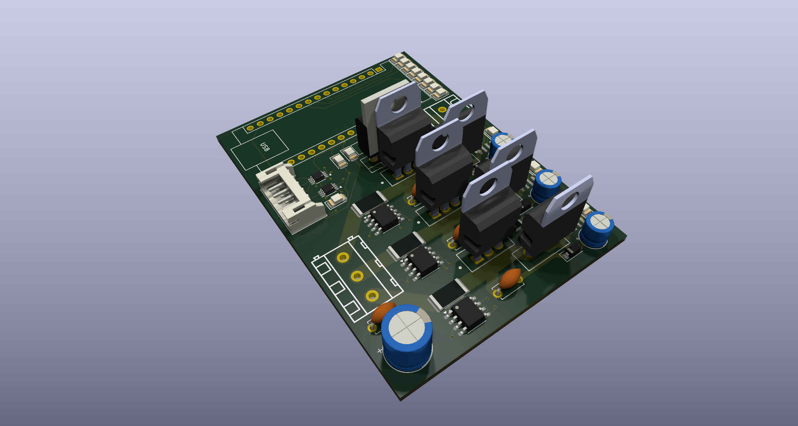

# FOCMotorController

A 12v brushless DC motor controller capable of [field-oriented control](https://en.wikipedia.org/wiki/Vector_control_(motor)) (also known as vector control), which is a control system concept that can improve the efficiency and power output of motors using current-based feedback.

I wanted to learn how field-oriented control systems (and brushless motor controllers in general) work, so I made a PCB from scratch!

</img>

## Design goals
- Allow 10-amp continuous operation
- Run field-oriented control
- Runs off an RP2040 Arduino devboard
- Operate at relatively high efficiency: I don't have a specific goal in mind, but ideally it would experience less than a few watts loss at peak load
- Allow controlling the [REV NEO](https://www.revrobotics.com/rev-21-1650/) series motors from the FRC ecosystem because I have access to many old ones.
- Record accurate quadrature encoder readings for tight closed-loop control
- Build for under $200

## Bill of materials

There are a few main components I needed to choose for this project:
- **MOSFETs:** This is pretty much just a tradeoff between efficiency, size, and price. I landed on the STM [STP55NF06L](https://www.st.com/content/ccc/resource/technical/document/datasheet/49/c5/a8/71/93/60/4f/86/CD00002690.pdf/files/CD00002690.pdf/jcr:content/translations/en.CD00002690.pdf) power MOSFET,
which has a very low static resistance when on with a gate voltage of >10V. At only 3.3V, the resistance is quite high, meaning we need a gate driver circuit to improve the driver's efficiency.
- **Gate drivers**: I chose the [IR2104](https://www.infineon.com/dgdl/Infineon-IR2104-DS-v01_00-EN.pdf?fileId=5546d462533600a4015355c7c1c31671) half-bridge gate drivers primarily because they're cheap and widely available.
Also, since they're half-bridge, they manage both the voltage and ground MOSFETs for their phase, which simplifies the control logic.
- **Current measurement circuitry**: There are [quite a few methods available for sensing current](https://www.nxp.com/docs/en/application-note/AN14164.pdf) in motor controllers, but the simplest is using a shunt resistor and relying on Ohm's law.
This is what I ended up doing. I use a [INA240 amplifier](https://www.ti.com/lit/ds/symlink/ina240.pdf) reading across a 6mΩ resistor to convert the tiny voltage potential difference to something readable by the microcontroller.
I'm interested to see what the signal-to-noise ratio will look like.
- Other miscellaneous things like logic level shifters because we're using a 3.3v microcontroller and 5v encoders. All components use a relatively large form-factor where possible to make hand-soldering simpler (altough there are a few tiny SMT components).

Here are all the components required and their price as of July 2025 from JLCPCB.
Of course, many of these can be sourced cheaper elsewhere and soldered manually.

|Name     |Purpose|Quantity|JLC part number|Total Price|
|---------|-------|--------|---------------|-----------|
|STP55NF06L|The main MOSFET we use|6|[C77582](https://jlcpcb.com/partdetail/STMicroelectronics-STP55NF06L/C77582)|$5.91|
|IR2104STRPBF|The main gate drivers|3|[C2960](https://jlcpcb.com/partdetail/InfineonTechnologies-IR2104STRPBF/C2960)|$1.15|
|Arduino Nano RP2040 Connect|The microcontroller used|1|n/a|$19.10 (on Amazon)|
|SN74LVC2T45DCTR|Level shifters for quadrature encoder input|2|[C22672](https://jlcpcb.com/partdetail/TexasInstruments-SN74LVC2T45DCTR/C22672)|$0.44|
|INA240A1D|The amplifier used for current sensing|3|[C2060769](https://jlcpcb.com/partdetail/TexasInstruments-INA240A1D/C2060769)|$4.32|
|PA2512FKF7W0R006E|The low-resistance 6mΩ shunt resistor|3|[C728340](https://jlcpcb.com/partdetail/YAGEO-PA2512FKF7W0R006E/C728340)|$0.30|
|A16-1000|A resettable fuse for the power input|1|[C135398](https://jlcpcb.com/partdetail/Shenzhen_JDTFuse-A161000/C135398)|$0.09|
|KM477M035F16RR0VH2FP0|470uF capacitor for input smoothing|1|[C47888](https://jlcpcb.com/partdetail/48894-KM477M035F16RR0VH2FP0/C47888)|$0.05|
|KM477M035F16RR0VH2FP0|0.1uF capacitor for input smoothing|1|[C47888](https://jlcpcb.com/partdetail/48894-KM477M035F16RR0VH2FP0/C47888)|$0.05|
|50YXF1MEFC5X11|1uF capacitor for decoupling gate drivers|3|[C2927584](https://jlcpcb.com/partdetail/Rubycon-50YXF1MEFC5X11/C2927584)|$0.13|
|CC1H104MC1FD3F6C10SA|100nF capacitor for bootstrapping|3|[C5375966](https://jlcpcb.com/partdetail/Dersonic-CC1H104MC1FD3F6C10SA/C5375966)|$0.07|
|S6B-PH-K-S(LF)(SN)|6-pin JST connector for encoder|1|[C157920](https://jlcpcb.com/partdetail/JST-S6B_PH_K_S_LF_SN/C157920)|$0.07|
|XL-3216UGC-FB|Green status LEDs|3|[C3646937](https://jlcpcb.com/partdetail/XINGLIGHT-XL_3216UGCFB/C3646937)|$0.04|
|XL-3216SURC-FB|Red power LED|1|[C3646938](https://jlcpcb.com/partdetail/XINGLIGHT-XL_3216SURCFB/C3646938)|$0.01|
|B0530W|500mA diode for bootstrap power|3|[B0530W](https://jlcpcb.com/partdetail/2459-B0530W/C2102)|$0.10|
|MBR1045G|10A Schottky Diode for power source|1|[C79734](https://jlcpcb.com/partdetail/onsemi-MBR1045G/C79734)|$0.86|
|SMAJ15A|TVS diode for voltage spike protection|1|[C113958](https://jlcpcb.com/partdetail/115197-SMAJ15A/C113958)|$0.04|
|WJ128V-5.0-3P|Screw terminal block for phase output|1|[C8270](https://jlcpcb.com/partdetail/Ningbo_KangnexElec-WJ128V_5_03P/C8270)|$0.16|
|WJ128V-5.0-2P|Screw terminal block for voltage input|1|[C8269](https://jlcpcb.com/partdetail/Ningbo_KangnexElec-WJ128V_5_02P/C8269)|$0.11|
|1206W4J0332T5E|3.3kohm resistor, misc|1|[C26041](https://jlcpcb.com/partdetail/26784-1206W4J0332T5E/C26041)|$0.01|
|1206W4F2001T5E|2kohm resistor, misc|1|[C17944](https://jlcpcb.com/partdetail/18632-1206W4F2001T5E/C17944)|$0.01|
|1206W4J0621T5E|620ohm resistor, misc|1|[C25391](https://jlcpcb.com/partdetail/26134-1206W4J0621T5E/C25391)|$0.01|
|FRC1206J101 TS|100ohm resistor, misc|3|[C2907422](https://jlcpcb.com/partdetail/FOJAN-FRC1206J101TS/C2907422)|$0.01|
|1206W4F4702T5E|47kohm pulldown resistors|4|[C25833](https://jlcpcb.com/partdetail/26576-1206W4F4702T5E/C25833)|$0.02|
|FRC1206F19R6TS|19.6ohm gate resistors|6|[C2933621](https://jlcpcb.com/partdetail/FOJAN-FRC1206F19R6TS/C2933621)|$0.02|

Total part cost for 1 board:
- $8.02 without microcontroller or MOSFETs
- $13.93 without microcontroller
- $33.03 with microcontroller   

Note that, if you're doing assembly through something like JLCPCB, you'll need to make 5. If you don't need 5 boards, you can avoid assembly for the MOSFETs and order them yourself. They're one of the easiest components to solder on the board.

## Software
Currently, there's a testing piece of software written in Python to run on a local system and simulate the motor controller.
Obviously, Python won't be fast enough for high-speed closed-loop control on the motor controller,
so I'll move to C++ once I have the ability to test more easily.

## Hackatime
Project name: `focMotorController`

Note that I initially had some issues with kicad-wakatime, so it didn't track ~8 hours of work :(

## Future investigation (once I actually have a PCB lol)
- Does it actually work?
- Do we need a heatsink? We should be dissipating an average of ~0.32W per MOSFET at peak load, and 2 watts spread over 6 devices is a very minimal amount of heat. Maybe if we drive it harder, but the rest of the circuit would probably break before the MOSFETs...

## Resources
- [Current Sensing Techniques in Motor Control Applications](https://www.nxp.com/docs/en/application-note/AN14164.pdf)
- [Bootstrap Circuitry Selection for Half Bridge Configurations](https://www.ti.com/lit/an/slua887a/slua887a.pdf)
- [Bypass Capacitor, Its Functions and Applications](https://www.elprocus.com/bypass-capacitor-its-functions-and-applications/)

### Datasheets
- [INA240 Bidirectional, Ultra-Precise Current Sense Amplifier](https://www.ti.com/lit/ds/symlink/ina240.pdf)
- [Datasheet IR2104(S) & (PbF)](https://www.infineon.com/dgdl/Infineon-IR2104-DS-v01_00-EN.pdf?fileId=5546d462533600a4015355c7c1c31671)
- [Datasheet STP55NF06L N-channel Power MOSFET](https://www.st.com/content/ccc/resource/technical/document/datasheet/49/c5/a8/71/93/60/4f/86/CD00002690.pdf/files/CD00002690.pdf/jcr:content/translations/en.CD00002690.pdf)

### JLCPCB parts (will probably change)
- [PA2512FKF7W0R006E - 2W ±100ppm/℃ ±1% 6mΩ 2512 Chip Resistor - Surface Mount ROHS](https://jlcpcb.com/partdetail/YAGEO-PA2512FKF7W0R006E/C728340)
- [A16-1000 - 16V 10A 40A 17A Plugin Resettable Fuses ROHS](https://jlcpcb.com/partdetail/Shenzhen_JDTFuse-A161000/C135398)
- [KM477M035F16RR0VH2FP0 - 470uF 35V ±20% Plugin,D8xL16mm Aluminum Electrolytic Capacitors - Leaded ROHS](https://jlcpcb.com/partdetail/48894-KM477M035F16RR0VH2FP0/C47888)
- [50YXF1MEFC5X11 - 1uF 50V ±20% Plugin,D5xL11mm Aluminum Electrolytic Capacitors - Leaded ROHS](https://jlcpcb.com/partdetail/Rubycon-50YXF1MEFC5X11/C2927584)
- [CC1H104MC1FD3F6C10SA - ±20% 100nF Y5V 50V Plugin,P=5.08mm Through Hole Ceramic Capacitors ROHS](https://jlcpcb.com/partdetail/Dersonic-CC1H104MC1FD3F6C10SA/C5375966)
- [S6B-PH-K-S(LF)(SN) - 1x6P 6P PH Tin 6 -25℃~+85℃ 2A 1 2mm Brass Bend insert Push-Pull,P=2mm Wire To Board Connector ROHS](https://jlcpcb.com/partdetail/JST-S6B_PH_K_S_LF_SN/C157920)
- [XL-3216UGC-FB - 5mA 86mcd~299mcd Reverse Mount 510nm~537nm Emerald 120° 75mW 2.6V~3.2V 1206 LED Indication - Discrete ROHS](https://jlcpcb.com/partdetail/XINGLIGHT-XL_3216UGCFB/C3646937)
- [XL-3216SURC-FB - 5mA 100mcd~120mcd Reverse Mount 617nm~627nm Red 120° 60mW 1.8V~2.1V 1206 LED Indication - Discrete ROHS](https://jlcpcb.com/partdetail/XINGLIGHT-XL_3216SURCFB/C3646938)
- [B0530W - 30V 430mV@500mA 500mA SOD-123 Schottky Diodes ROHS](https://jlcpcb.com/partdetail/2459-B0530W/C2102)
- [MBR1045G - 45V 570mV@10A 10A TO-220-2 Schottky Diodes ROHS](https://jlcpcb.com/partdetail/onsemi-MBR1045G/C79734)
- [INA240A1DR - Single Channel SOIC-8 Current Sense Amplifiers ROHS](https://jlcpcb.com/partdetail/TexasInstruments-INA240A1DR/C2060769)